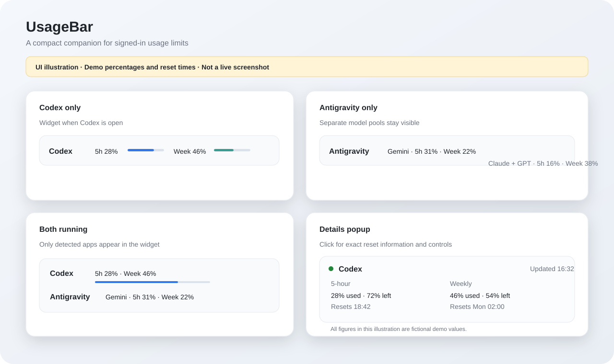

# UsageBar

**See your Codex and Antigravity limits without leaving your taskbar.**

[](https://github.com/ghostySRC/UsageBar/actions/workflows/ci.yml)
[](https://github.com/ghostySRC/UsageBar/releases/latest)
[](https://www.microsoft.com/windows/windows-11)
[](LICENSE)



*Illustration only. The percentages and reset times shown above are labeled demo values, not a live account screenshot.*

UsageBar is a small Windows 11 tray utility that shows the real five-hour and weekly usage windows reported by your signed-in Codex and Antigravity apps. It appears next to the taskbar while either app is open, stays hidden when neither is open, and keeps all data on your PC.

## Download

Download **[UsageBar-Setup.exe](https://github.com/ghostySRC/UsageBar/releases/latest/download/UsageBar-Setup.exe)** from the latest release. The per-user installer does not require administrator access and includes the .NET runtime. Windows may show a SmartScreen warning because this open-source build is not code-signed.

To update, download and run the newer setup file. It updates the app in place and keeps your local settings and cache. Uninstall UsageBar from **Settings → Apps → Installed apps**.

## Features

- Real five-hour and weekly usage, remaining capacity, and reset times.
- Automatic detection of Codex and Antigravity; no manual provider selection.
- Separate Gemini and Claude/GPT quota pools when Antigravity reports them.
- Compact progress bars, a detail popup, and an always-available tray menu.
- Refresh on app open/close, popup open, network return, resume from sleep, and a configurable interval.
- Per-user startup by default, a single-instance mutex, local cache, and light/dark theme support.
- Frameless, no-activate taskbar-edge widget with saved position, monitor-aware DPI sizing, and drag-to-snap placement.
- No Explorer injection, credential-file parsing, token logging, analytics, or UsageBar server.

## Usage

Install and sign in to the official Codex and/or Antigravity app. UsageBar starts in the system tray and shows a small widget next to the taskbar while a monitored app is running. Click the widget for five-hour and weekly details, reset times, and the last successful update. Right-click the tray icon for refresh, settings, app launch, or exit actions.

The compact widget shows consumed percentages by default. Use **Settings → Percentages show** to display remaining capacity instead. Progress bars always represent remaining capacity. Hover over a provider group for precise values, reset dates, and freshness status.

If the provider cannot refresh, UsageBar keeps the last valid snapshot and marks it stale in the popup. If no successful snapshot exists yet, it displays unavailable values; it never estimates usage.

## Provider support and how values are read

### OpenAI Codex

UsageBar launches the locally installed `codex app-server --stdio`, performs the documented App Server initialization handshake, and calls `account/rateLimits/read`. Codex supplies the five-hour and weekly windows, used percentages, and Unix reset timestamps. UsageBar does not read Codex credential files or ask for an API key. You must be signed in to the same local Codex installation.

### Google Antigravity

UsageBar finds the running Antigravity language server, its loopback listener, and the CSRF argument on that matching process. It calls the server's local `RetrieveUserQuotaSummary` route and displays every quota group returned, including Gemini and Claude/GPT pools where available. The CSRF value is held in memory only.

**Compatibility note:** Antigravity does not publish this local quota route as a stable public API. An Antigravity update may change it. When the route is unavailable, UsageBar reports the provider status and preserves the last successful values as stale. The app does not scrape pixels or infer limits from token counts.

Codex usage is provided by OpenAI's installed App Server interface. Antigravity usage is provided by the local Antigravity app. Both provider applications make their own authenticated network requests; UsageBar has no remote usage service.

## Settings

Settings are saved to `%LOCALAPPDATA%\UsageBar\settings.json`.

- Start UsageBar with Windows (on by default; current-user `Run` key, no admin).
- Choose a 30-second, 1-, 2-, or 5-minute refresh interval (1 minute by default).
- Show used or remaining percentages, hide percentages, or hide compact progress bars.
- Toggle compact model-group labels, always-on-top behavior, the taskbar-edge widget, and each provider.
- Reset the widget position.

## Privacy and local storage

UsageBar has no account sign-in, analytics, cloud sync, or hosted tracker. It reuses each provider app's local authenticated interface. The Codex app server and Antigravity language server continue to handle their own provider connections.

The last successful normalized snapshot is stored in `%LOCALAPPDATA%\UsageBar\usage-cache.json` so the popup can show stale values offline. Sanitized, bounded logs are stored under `%LOCALAPPDATA%\UsageBar\logs`; logs omit usage values, process command lines, tokens, request headers, and response bodies. No credentials are committed or uploaded by UsageBar.

## Requirements and known limitations

- Windows 11 x64, with Codex and/or Antigravity installed and signed in.
- The installer is self-contained; a separate .NET runtime installation is not needed.
- Codex values require the installed Codex App Server to support `account/rateLimits/read`.
- Antigravity's local quota route is undocumented and may change between app versions.
- Windows does not provide a supported way for a normal desktop utility to embed inside the taskbar. UsageBar uses a small frameless window outside the taskbar window tree. It remembers its monitor and position, snaps to the current taskbar edge, and does not steal focus or enter Alt+Tab.
- There is no code-signing certificate in this project, so SmartScreen may ask you to confirm a downloaded installer.

## Build from source

Requirements: Windows 11 x64, .NET 10 SDK, and Inno Setup 6 (only to build the installer).

```powershell
dotnet restore UsageBar.sln
dotnet build UsageBar.sln --configuration Release --no-restore
dotnet test UsageBar.sln --configuration Release --no-build
./tools/Build-Release.ps1 -Version 1.0.0
```

The build script writes a self-contained app and setup program beneath `artifacts/`. Run `dotnet run --project tools/UsageBar.ProviderProbe` to check your live provider connections locally. That diagnostic prints real account percentages and reset times to the console; do not paste its output into a public issue.

## Project layout

```text
src/UsageBar.Core/        Providers, parsers, process discovery, cache, refresh lifecycle
src/UsageBar.Windows/     WPF tray app, widget, popup, settings, Windows integration
tests/UsageBar.Tests/     Provider parser tests
tools/                    Live provider probe and release build script
installer/                Inno Setup per-user installer definition
docs/                     Architecture and labeled UI illustration
```

See [docs/architecture.md](docs/architecture.md), [CONTRIBUTING.md](CONTRIBUTING.md), and [SECURITY.md](SECURITY.md).

## Troubleshooting

- **No widget:** confirm a supported app is open and its provider checkbox is enabled. UsageBar hides the widget when neither monitored app is detected.
- **Sign-in required or unavailable:** sign in again in the provider app, then choose **Refresh** in the UsageBar popup.
- **Antigravity not refreshing after an app update:** check for a UsageBar update. Its local quota route is not a stable public API.
- **Stale values:** open the popup to see the last successful refresh and provider status. UsageBar retries with backoff and refreshes when connectivity returns.
- **Position or scale looks wrong:** choose **Reset widget position** in Settings. The widget follows the active monitor and its taskbar edge.
- **Logs:** `%LOCALAPPDATA%\UsageBar\logs\usagebar.log`. Logs use sanitized failure categories and should not contain account values or credentials.

## Contributing and license

Bug reports and focused pull requests are welcome; please redact account data from reports. See [CONTRIBUTING.md](CONTRIBUTING.md). UsageBar is distributed under the [MIT License](LICENSE).
